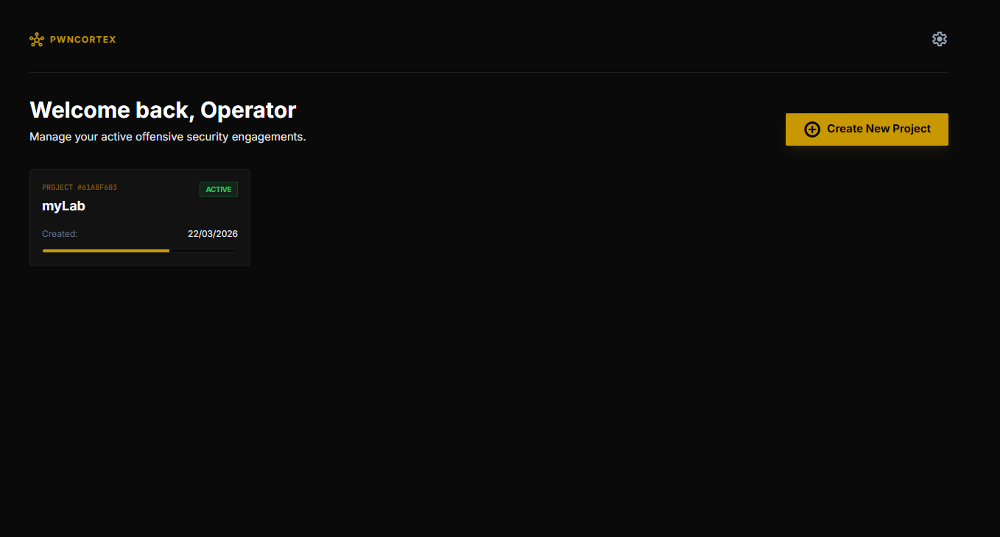
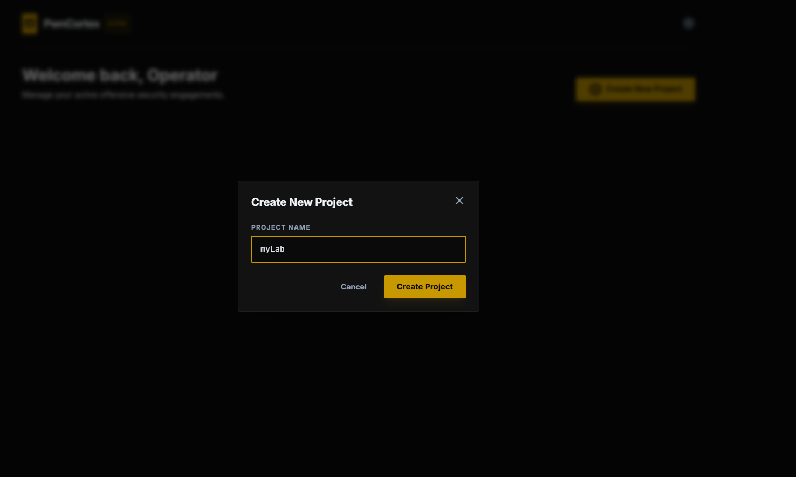
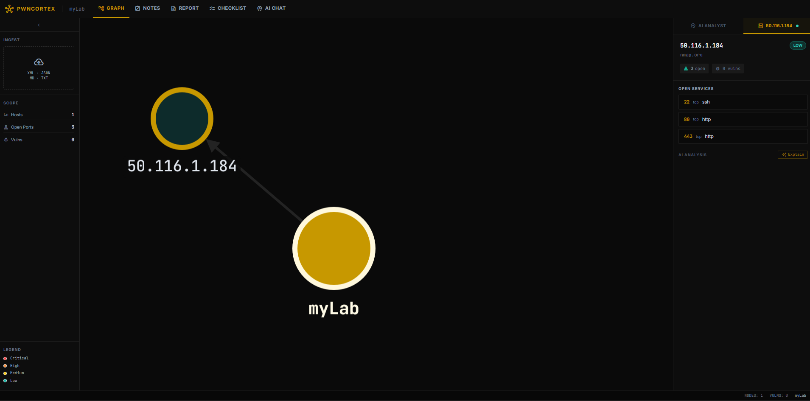
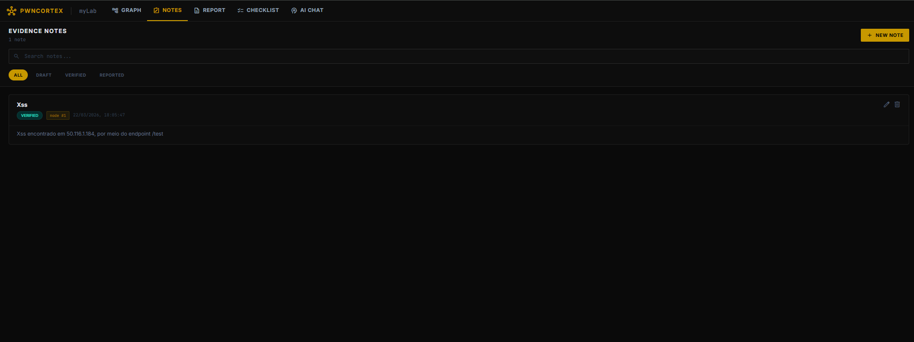
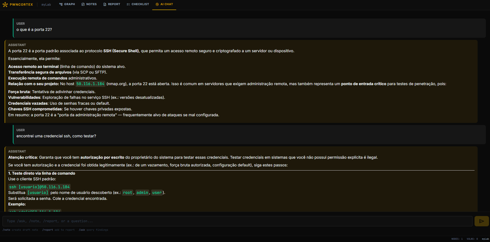
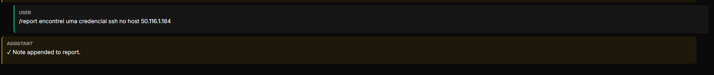
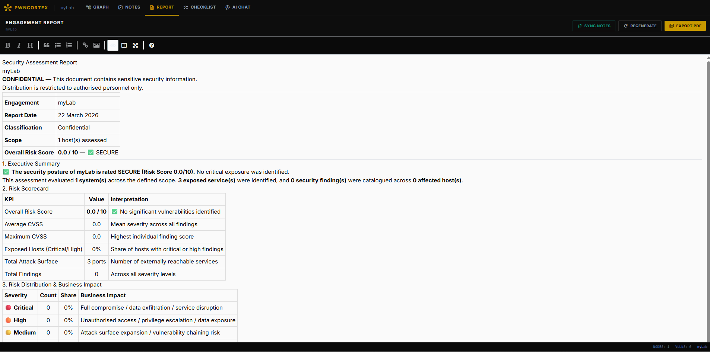
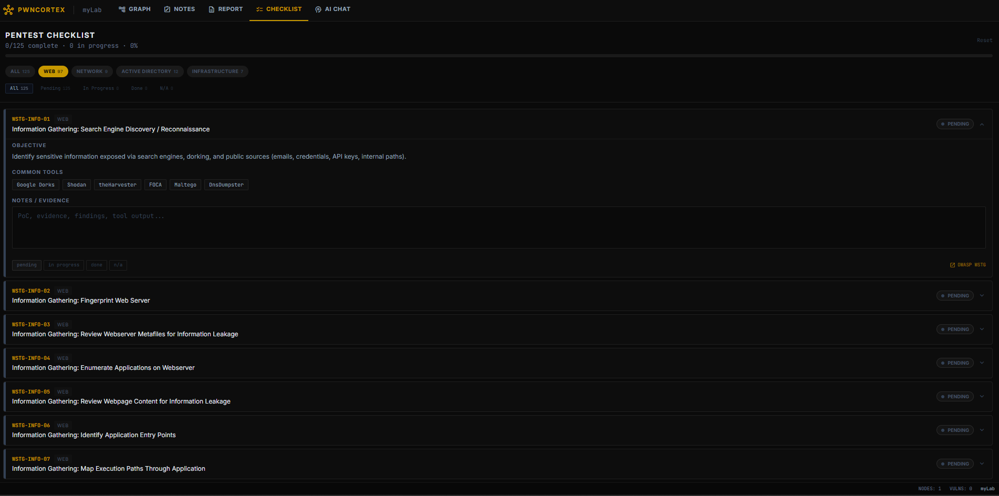
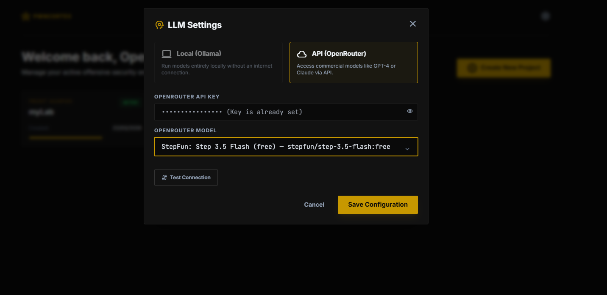

<div align="center">
  
  <h1>PwnCortex</h1>
  <p><strong>Plataforma de produtividade para pentests com IA — 100% self-hosted.</strong></p>
  <p>
    <a href="LICENSE"></a>
  </p>
</div>

## O que é o PwnCortex

O PwnCortex foi construído para resolver um problema real do pentester moderno: **centralizar toda a inteligência de um engagement em um único lugar, com IA contextual integrada**. Ao contrário de planilhas soltas e ferramentas fragmentadas, o PwnCortex transforma scans brutos (Nmap XML, JSON, MD, TXT) em uma topologia de rede interativa, enriquece cada host automaticamente via NVD/CVE, permite análise em linguagem natural com um LLM que conhece todo o contexto do projeto, e gera um relatório executivo com scoring CVSS pronto para o cliente. Tudo localmente, sem telemetria, sem nuvem.

---

## Funcionalidades

- **Ingestão Unificada de Scans**: importe Nmap XML, JSON, Markdown ou texto puro. Portas, serviços, strings CPE e saída de scripts NSE são parseados em registros estruturados automaticamente.
- **Grafo de Rede Interativo**: topologia Cytoscape.js construída a partir dos scans ingeridos. Selecione um nó para ver portas, vulnerabilidades e explicações geradas por IA (cacheadas por sessão).
- **AI Chat Contextual**: faça perguntas sobre o alvo em linguagem natural. O LLM recebe o contexto completo do projeto (nós, portas, vulns, notas) a cada mensagem. Suporta Ollama local e OpenRouter.
- **Notas de Evidência**: crie, filtre e pesquise findings com ciclo de vida `Rascunho → Verificado → Reportado`. Notas verificadas sincronizam automaticamente com o rascunho do relatório executivo.
- **Relatório Executivo Automatizado**: gera relatório confidencial em Markdown com sumário executivo, scorecard de risco, roadmap de remediação ranqueado por CVSS e apêndice técnico. Exportável para PDF.
- **Checklist OWASP WSTG**: 121 itens nas categorias Web, Rede, Active Directory e Infraestrutura com rastreamento de status por item e progresso visual.
- **Dois Provedores de LLM**: use Ollama local (padrão: `qwen2.5:3b`) para engagements air-gapped, ou troque para qualquer modelo OpenRouter pela interface a qualquer momento.
- **Enriquecimento NVD/CVE**: vulnerabilidades são automaticamente enriquecidas com scores CVSS da API do NVD.
- **100% Local**: sem telemetria, sem dependência de nuvem. Todos os dados ficam em um banco SQLite na sua máquina.

---

## Conceitos Técnicos

### Contexto Compartilhado de IA
A cada mensagem no AI Chat, o LLM recebe um *system prompt* construído dinamicamente com todos os nós, portas abertas, vulnerabilidades e notas do projeto. Isso elimina a necessidade de copiar e colar dados manualmente. Logo, o modelo sempre sabe exatamente o que está no escopo.

### Ciclo de Vida das Notas
As notas seguem um pipeline `Draft → Verified → Reported`. Quando uma nota é marcada como `Verified` ou `Reported`, ela é sincronizada automaticamente via BackgroundTask para o `report_draft` do projeto, garantindo que o relatório executivo sempre reflita o estado atual da investigação.

### Scoring CVSS Automático
O relatório executivo calcula um **Overall Risk Score** por host usando soma de quadrados normalizada dos scores CVSS. Se um CVE não possui score no banco, o sistema infere o valor pela severidade (Critical→9.5, High→7.5, Medium→5.0, Low→2.5) e marca como *(inferido)*.

### Cache de Explicações por Nó
Cada vez que o LLM gera uma explicação para um nó (portas, serviços, recomendações), ela é persistida no banco. O cache é invalidado automaticamente quando novos dados de scan ou notas são adicionados ao nó, garantindo que a explicação sempre esteja atualizada.

---

## Tour Visual

O PwnCortex oferece uma interface técnica e escura, projetada para longas sessões de trabalho com foco em densidade de informação.

### 1. Dashboard — Gestão de Projetos
Crie e gerencie seus engagements. Cada projeto é isolado com UUID próprio.

<div align="center">
  
  
</div>

*À esquerda: visão geral dos projetos ativos. À direita: modal de criação de projeto.*

---

### 2. Graph View — Topologia de Rede
O coração visual do projeto. Após ingerir um scan, o grafo é construído automaticamente. Clique em qualquer nó para ver detalhes, portas, vulnerabilidades e solicitar explicação de IA.



*Topologia interativa com layout concentric. O painel direito exibe detalhes do nó selecionado com análise de IA cacheada.*

---

### 3. Notas de Evidência
Registre e organize findings com suporte a Markdown, filtros por status e busca full-text. Notas verificadas alimentam o relatório automaticamente.

<div align="center">
  
</div>

*lista de notas com filtros de status*

---

### 4. AI Chat — Análise Contextual
Converse com o LLM sobre o seu alvo. Use comandos slash para criar notas e registros de relatório diretamente pelo chat.



*O assistente explica vetores de ataque, sugere próximos passos e mantém todo o contexto do projeto na conversa.*



*Comando `/report` adicionando uma nota de analista ao rascunho do relatório executivo.*

---

### 5. Relatório Executivo
Gere um relatório confidencial em Markdown com linguagem executiva e técnica. Inclui scorecard de risco, roadmap de remediação por janela de tempo (0–48h / 2 sem / 30 dias / 90 dias) e apêndice técnico com todos os findings.



---

### 6. Checklist OWASP WSTG
121 itens de segurança organizados por categoria com rastreamento individual de status e progresso visual.



---

### 7. Configuração do LLM
Alterne entre Ollama local e OpenRouter sem reiniciar o stack. A API key nunca é exposta — apenas o booleano `key_set`.

<div align="center">
  
</div>

---

## Como Executar

### Pré-requisitos
- [Docker](https://docs.docker.com/get-docker/) instalado e rodando.
- Plugin Compose (`docker compose version`).

### Instalação

```bash
# Clone o repositório
git clone https://github.com/your-org/pwncortex.git
cd pwncortex

# Copie e configure o .env
cp .env.example .env

# Inicie o stack (interativo — seleciona modo Ollama local ou API)
./start.sh
```

### Acesso

| Serviço | URL |
|---|---|
| Interface Web | http://localhost:80 |
| API | http://localhost:8000 |
| Ollama | http://localhost:11434 |

### Desenvolvimento com Hot-Reload

```bash
docker compose -f docker-compose.yml -f docker-compose.dev.yml up
# Frontend dev: http://localhost:5173
```

> **Parar**: `./stop.sh` — preserva volumes e banco de dados.
> **Resetar**: `./reset.sh` — para containers, remove imagens e reconstrói do zero.

### Variáveis de Ambiente

| Variável | Descrição | Padrão |
|:---|:---|:---|
| `LLM_PROVIDER` | Provider ativo: `ollama` ou `openrouter` | `ollama` |
| `OLLAMA_MODEL` | Modelo Ollama a utilizar | `qwen2.5:3b` |
| `OPENROUTER_API_KEY` | API Key do OpenRouter (opcional) | — |
| `OPENROUTER_MODEL` | Modelo OpenRouter a utilizar | `anthropic/claude-3.5-haiku` |

> As variáveis também podem ser alteradas em tempo de execução pelo ícone de **Configurações** na interface, sem necessidade de reiniciar o stack.

---

## Arquitetura

- **Backend** (`src/server`): Python 3.12, FastAPI, Uvicorn. BackgroundTasks para IA e parsers pesados.
- **Domínio** (`src/domain`): clientes LLM (Ollama + OpenRouter), parser Nmap, gerador de relatório, sync de notas.
- **Banco de Dados** (`src/data`): SQLAlchemy 2.x + SQLite. UUID para IDs de projeto (previne IDOR).
- **Frontend** (`src/web`): React 18, Vite, TailwindCSS 3, Cytoscape.js, EasyMDE.
- **Proxy**: Nginx — roteamento `/api` → FastAPI, `/` → React.

---

## Troubleshooting

**O stack não sobe / portas ocupadas?**
Verifique se as portas `80`, `8000` e `11434` estão livres. Execute `./reset.sh` para limpar containers e imagens.

**Erro `404 No endpoints available` no OpenRouter?**
Acesse `openrouter.ai/settings/privacy` e relaxe a política de guardrails de dados.

**O Ollama não responde?**
Confirme que o serviço está saudável: `docker compose ps`. O container `ollama` usa profile `local` — suba com `--profile local` ou via `./start.sh`.

**Explicação de nó desatualizada?**
O cache de explicações é invalidado automaticamente ao ingerir novos scans ou adicionar notas. Se necessário, exclua o nó e reimporte o scan.

---


## Aviso Legal

O PwnCortex é destinado **exclusivamente a testes de segurança autorizados**. O uso desta ferramenta contra sistemas sem permissão escrita explícita é ilegal. Os autores não se responsabilizam por uso indevido.

---

## Licença

Este projeto está licenciado sob a **AGPL-3.0**. Veja o arquivo [LICENSE](LICENSE) para mais detalhes.
